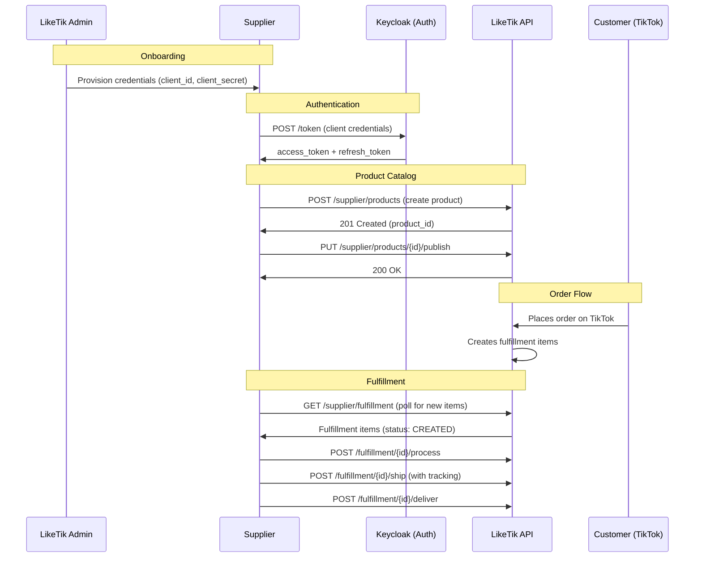

> This API is under active development — breaking changes to endpoints, schemas, and auth flows may occur. Always check the [Swagger UI](https://backend-test.liketik.com/docs/supplier/index.html) for the latest details.

The current API base URL is:

```
https://backend-test.liketik.com/
```

You can explore all available endpoints, request/response schemas, and test calls interactively in the [Swagger UI](https://backend-test.liketik.com/docs/supplier/index.html). We recommend keeping it open while you integrate.

LikeTik connects suppliers with creators who sell products on TikTok. You provide products and fulfill orders. LikeTik takes care of the storefront, creator relationships, and the customer-facing side.

Your integration follows four steps:

1. **Onboarding** , LikeTik provisions your account and sends you API credentials
2. **Authentication** , you obtain OAuth2 tokens to call the API
3. **Product catalog** , you create and manage your product listings
4. **Order fulfillment** , you receive fulfillment requests and update their status as you process, ship, and deliver items

### Key Concepts

| Term | Definition |
|------|------------|
| **Supplier** | A business entity that provides products and fulfills orders on the LikeTik platform. Each supplier has a unique ID (e.g., `EXTERNAL_SUP_acme-prints`). |
| **Product** | A catalog item defined by a supplier. Products contain one or more variants and progress through a lifecycle (Draft, Published, Unpublished, Archived). |
| **Product Variant** | A specific purchasable configuration of a product (e.g., size, color). Each variant has its own SKU, pricing, and inventory attributes. |
| **Product Lifecycle** | The publication state of a product: `DRAFT` (initial) -> `PUBLISHED` (visible in catalog) -> `UNPUBLISHED` (removed, can republish) -> `ARCHIVED` (soft-deleted, terminal). |
| **Fulfillment** | A group of items that need to be fulfilled for an order. A single order may produce one or more fulfillments. |
| **Fulfillment Item** | An individual line item within a fulfillment. Each item tracks its own status independently. |
| **Fulfillment Item Status** | The processing state of a fulfillment item: `CREATED` -> `FORWARDED` -> `PROCESSING` -> `SHIPPED` -> `DELIVERED` (terminal). Items can also reach `FAILED` (terminal) from any non-terminal state. |
| **Availability** | Whether a product variant is purchasable: `IN_STOCK`, `NEVER_OUT_OF_STOCK` (e.g., print-on-demand), `OUT_OF_STOCK`, or `DISCONTINUED`. |

### ID Formats

All IDs use predictable prefixed formats:

| Entity | Format | Example |
|--------|--------|---------|
| Product | `P_{UUID}` | `P_8f14e45f-ceea-5367-b3c5-1a8e3c7f0c42` |
| Product Variant | `PV_{UUID}` | `PV_3c9a7e6b-d4f2-5a1e-8b7c-9d0e1f2a3b4c` |
| Fulfillment | `F_{UUID}` | `F_a2b29477-1a2b-5c3d-9e4f-5a6b7c8d9e0f` |
| Fulfillment Item | `FI_{UUID}` | `FI_019477f8-1a2b-7c3d-9e4f-5a6b7c8d9e0f` |
| Supplier | `EXTERNAL_SUP_{slug}` | `EXTERNAL_SUP_acme-prints` |
| Category | `PC_{UUID}` | `PC_f47ac10b-58cc-4372-a567-0e02b2c3d479` |

### Conventions

- **Field naming:** All JSON fields use `snake_case` (e.g., `supplier_product_id`, `tracking_number`)
- **Currency:** Monetary amounts are expressed in **minor units** (cents) with an ISO 4217 currency code. For example, EUR 14.99 is represented as `{ "amount": 1499, "currency": "EUR" }`
- **Country codes:** ISO 3166-1 alpha-3 (e.g., `DEU` for Germany, `AUT` for Austria, `CHE` for Switzerland)
- **Timestamps:** ISO 8601 format in UTC (e.g., `2025-01-15T10:30:00Z`)
- **Pagination:** All paginated endpoints use 1-based page numbering. Pass `page=1` for the first page

### Full Lifecycle Overview

This diagram shows the full supplier journey from onboarding through fulfillment:



### Data Flow Summary

| Data | Direction | Mechanism | Who Initiates |
|------|-----------|-----------|---------------|
| Credentials | LikeTik -> Supplier | Out-of-band (admin provisioned) | LikeTik admin |
| Supplier profile | LikeTik -> Supplier | `GET /supplier/profile/me` | Supplier pulls |
| Product catalog | Supplier -> LikeTik | `POST`/`PUT`/`DELETE` product endpoints | Supplier pushes |
| Order / fulfillment data | LikeTik -> Supplier | `GET /supplier/fulfillment` (paginated) | Supplier polls |
| Fulfillment status updates | Supplier -> LikeTik | `POST /supplier/fulfillment/{id}/{action}` | Supplier pushes |
| New order notifications | Not yet available | Webhooks (Coming Soon) | -- |

> **Note:** All data retrieval is pull-based (polling). You push product catalog data and fulfillment status updates. Webhook notifications for new orders are planned but not yet available (see [Webhooks](/docs/webhooks)).
