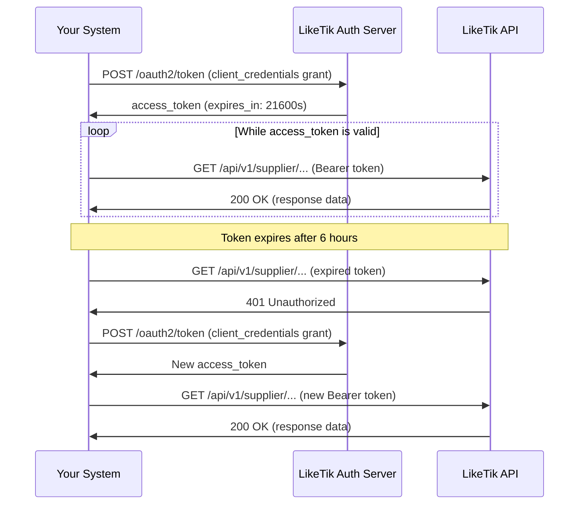

LikeTik authenticates API requests with the **OAuth2 Client Credentials** flow (machine-to-machine). Every API request must carry a valid access token in the `Authorization` header. There is no browser redirect, no user login, and no refresh token: your integration requests a token directly with its credentials whenever it needs one.

### Step 1: Obtain Credentials

Your LikeTik admin gives you a `client_id` (format `sup-<uuid>`) and a `client_secret` (see [Getting Started](/docs/getting-started)). The auth server and the API live on the same host:

| Environment | Base URL |
|-------------|----------|
| Test | `https://id-test.axinity.dev` |
| Production | `https://id.axinity.dev` (credentials issued at go-live) |

### Step 2: Request an Access Token

Exchange your credentials for an access token by sending a `POST` request to the token endpoint:

```bash
curl -X POST https://id-test.axinity.dev/oauth2/token \
  -H "Content-Type: application/x-www-form-urlencoded" \
  -d "grant_type=client_credentials" \
  -d "scope=products.supplier" \
  -d "client_id=YOUR_CLIENT_ID" \
  -d "client_secret=YOUR_CLIENT_SECRET"
```

```http
HTTP/1.1 200 OK
Content-Type: application/json

{
  "access_token": "eyJhbGciOiJSUzI1NiIsInR5cCI6IkpXVCJ9...",
  "token_type": "Bearer",
  "expires_in": 21600,
  "scope": "products.supplier"
}
```

HTTP Basic authentication (`-u YOUR_CLIENT_ID:YOUR_CLIENT_SECRET`) works as an alternative to passing the credentials in the body.

**Required parameters:**

| Parameter | Value | Description |
|-----------|-------|-------------|
| `grant_type` | `client_credentials` | The OAuth2 grant type. No other grant is enabled for supplier clients |
| `scope` | `products.supplier` | Grants full access to supplier APIs: products, bulk imports, fulfillment, and profile |
| `client_id` | Your client ID | Provided during onboarding |
| `client_secret` | Your client secret | Provided during onboarding |

> **Note:** The token automatically carries the `ProductSupplier` role and your supplier identity (`product_supplier.id` claim). Every API call is scoped to your own supplier account; you never pass your supplier ID yourself.

### Step 3: Use the Token in Requests

Add the access token to the `Authorization` header on every API request:

```bash
curl -X GET https://id-test.axinity.dev/api/v1/supplier/profile/me \
  -H "Authorization: Bearer ${ACCESS_TOKEN}"
```

### Step 4: Handle Token Expiry

Access tokens live **6 hours** (`expires_in: 21600` seconds). There are no refresh tokens in the client credentials flow; when a token expires, simply request a new one (Step 2). Two practical strategies:

- Track `expires_in` and request a fresh token shortly before expiry, or
- Request a new token whenever the API answers `401 Unauthorized`.

Token requests are cheap; do not cache tokens across process restarts or share them between systems.

### Step 5: Handle Authentication Errors

| HTTP Status | Cause | Resolution |
|-------------|-------|------------|
| `401 invalid_client` (token endpoint) | Wrong `client_id` or `client_secret` | Verify the credentials from onboarding. Contact [support@liketik.com](mailto:support@liketik.com) if you need them re-issued (secrets are shown only once) |
| `401 Unauthorized` (API calls) | Token expired, malformed, or missing | Request a new token (Step 2) and retry |
| `403 Forbidden` (API calls) | Supplier account inactive, or the token lacks the `products.supplier` scope | See [Troubleshooting](/docs/troubleshooting). Contact [support@liketik.com](mailto:support@liketik.com) if your account needs activation |

### Authentication Flow


