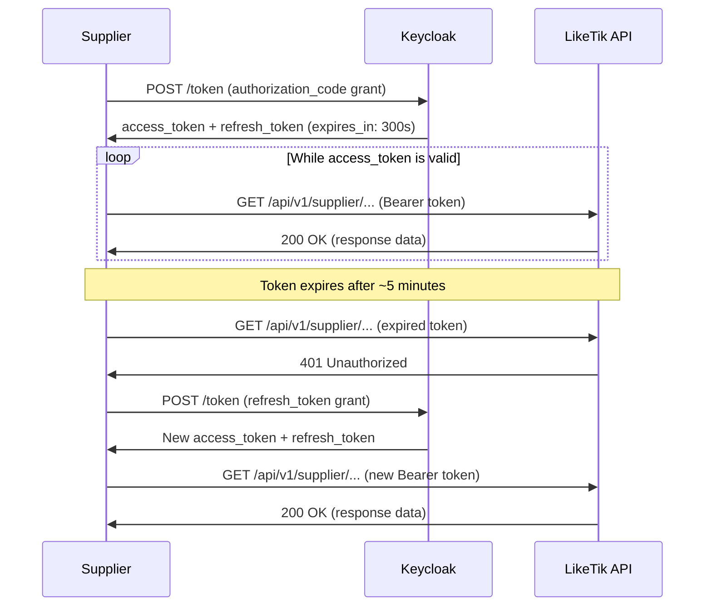

LikeTik authenticates API requests with **OAuth2 Authorization Code** flow via Keycloak. Every API request must carry a valid access token in the `Authorization` header.

### Step 1: Obtain Credentials

Your LikeTik admin gives you a `client_id`, `client_secret`, and the `{issuer_uri}` for your Keycloak realm (see [Getting Started](/docs/getting-started)).

### Step 2: Request an Access Token

Exchange your credentials for an access token by sending a `POST` request to the Keycloak token endpoint:

```bash
curl -X POST {issuer_uri}/protocol/openid-connect/token \
  -H "Content-Type: application/x-www-form-urlencoded" \
  -d "grant_type=authorization_code" \
  -d "client_id=YOUR_CLIENT_ID" \
  -d "client_secret=YOUR_CLIENT_SECRET" \
  -d "scope=openid products.supplier" \
  -d "code=AUTHORIZATION_CODE" \
  -d "redirect_uri=YOUR_REDIRECT_URI"
```

```http
HTTP/1.1 200 OK
Content-Type: application/json

{
  "access_token": "eyJhbGciOiJSUzI1NiIsInR5cCI6IkpXVCJ9...",
  "refresh_token": "eyJhbGciOiJIUzI1NiIsInR5cCI6IkpXVCJ9...",
  "expires_in": 300,
  "refresh_expires_in": 1800,
  "token_type": "Bearer",
  "scope": "openid products.supplier"
}
```

**Required parameters:**

| Parameter | Value | Description |
|-----------|-------|-------------|
| `grant_type` | `authorization_code` | The OAuth2 grant type |
| `client_id` | Your client ID | Provided during onboarding |
| `client_secret` | Your client secret | Provided during onboarding |
| `scope` | `openid products.supplier` | Required scopes for supplier API access |
| `code` | Authorization code | Obtained from the authorization endpoint |
| `redirect_uri` | Your redirect URI | Must match the registered redirect URI |

**Required scopes:**

| Scope | Purpose |
|-------|---------|
| `openid` | Required for authentication. Returns an ID token with user identity claims |
| `products.supplier` | Grants full access to supplier APIs: products, fulfillment, and profile |

> **Note:** Your account needs the `ProductSupplier` role (mapped from `resource_access.backend.roles` in the Keycloak token). LikeTik assigns this role during onboarding.

### Step 3: Use the Token in Requests

Add the access token to the `Authorization` header on every API request:

```bash
curl -X GET https://backend-test.liketik.com/api/v1/supplier/profile/me \
  -H "Authorization: Bearer ${ACCESS_TOKEN}"
```

### Step 4: Handle Token Expiry

Access tokens are short-lived (around 5 minutes). When yours expires, use the refresh token to get a new one without re-authenticating:

```bash
curl -X POST {issuer_uri}/protocol/openid-connect/token \
  -H "Content-Type: application/x-www-form-urlencoded" \
  -d "grant_type=refresh_token" \
  -d "client_id=YOUR_CLIENT_ID" \
  -d "client_secret=YOUR_CLIENT_SECRET" \
  -d "refresh_token=YOUR_REFRESH_TOKEN"
```

```http
HTTP/1.1 200 OK
Content-Type: application/json

{
  "access_token": "eyJhbGciOiJSUzI1NiIsInR5cCI6IkpXVCJ9...",
  "refresh_token": "eyJhbGciOiJIUzI1NiIsInR5cCI6IkpXVCJ9...",
  "expires_in": 300,
  "refresh_expires_in": 1800,
  "token_type": "Bearer",
  "scope": "openid products.supplier"
}
```

> **Tip:** Track the `expires_in` field (in seconds) and refresh your token before it expires. Refresh tokens last longer (around 30 minutes) but they expire too, forcing a full re-authentication. Exact lifetimes depend on realm configuration.

### Step 5: Handle Authentication Errors

| HTTP Status | Cause | Resolution |
|-------------|-------|------------|
| `401 Unauthorized` | Token expired, malformed, or missing | Refresh the token (Step 4). If the refresh token also expired, re-authenticate from Step 2 |
| `403 Forbidden` | Token valid but lacks the required role or scope | Check that your token includes the `products.supplier` scope and `ProductSupplier` role. Contact [suppliers@liketik.com](mailto:suppliers@liketik.com) if your account is misconfigured |

### Authentication Flow


