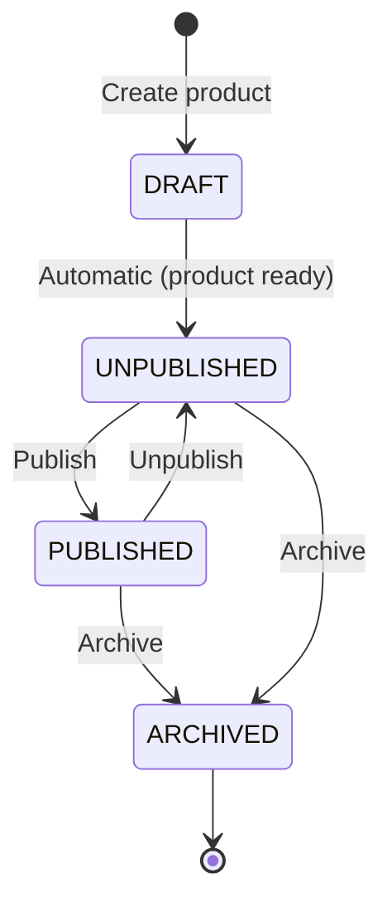

Products are at the center of your integration. You create listings with one or more variants, publish them to the catalog, and manage their lifecycle as inventory changes.

Every product starts in `DRAFT` state and must be published explicitly. Each product needs at least one variant. The variant at position `0` is the **representative variant**, which is the default shown to customers.

### Endpoint Summary

| Operation | Method | Path | Rate Limit |
|-----------|--------|------|------------|
| Create product | `POST` | `/api/v1/supplier/products` | heavy |
| Update variant | `PUT` | `/api/v1/supplier/products/{product_id}/variants/{variant_id}` | standard |
| Add variant | `POST` | `/api/v1/supplier/products/{product_id}/variants` | standard |
| Remove variant | `DELETE` | `/api/v1/supplier/products/{product_id}/variants/{variant_id}` | standard |
| Set representative variant | `PUT` | `/api/v1/supplier/products/{product_id}/variants/{variant_id}/representative` | standard |
| Publish product | `PUT` | `/api/v1/supplier/products/{product_id}/publish` | standard |
| Unpublish product | `PUT` | `/api/v1/supplier/products/{product_id}/unpublish` | standard |
| Update availability | `PUT` | `/api/v1/supplier/products/{product_id}/availability` | standard |
| Archive product | `DELETE` | `/api/v1/supplier/products/{product_id}/delete` | standard |
| Add review | `POST` | `/api/v1/supplier/products/{product_id}/add-review` | standard |
| Search products | `GET` | `/api/v1/supplier/products/search` | light |
| Calculate IDs | `GET` | `/api/v1/supplier/products/ids/calculate` | light |

### 5.1 Create Product

Create a new product with one or more variants. It starts in `DRAFT` state.

```bash
curl -X POST https://backend-test.liketik.com/api/v1/supplier/products \
  -H "Authorization: Bearer ${ACCESS_TOKEN}" \
  -H "Content-Type: application/json" \
  -d '{
    "supplier_product_id": "AP-TSHIRT-001",
    "variants": [
      {
        "supplier_variant_id": "AP-TSHIRT-001-BLK-XL",
        "sku": "ACME-BLK-XL-001",
        "info": {
          "names": {
            "en": "Classic Crew Neck T-Shirt - Black / XL",
            "de": "Klassisches T-Shirt Schwarz XL"
          },
          "descriptions": {
            "en": "Premium cotton crew neck t-shirt, screen-printed with eco-friendly inks.",
            "de": "Premium-Baumwoll-T-Shirt mit umweltfreundlichem Siebdruck."
          },
          "slugs": {
            "en": "classic-crew-neck-tshirt-black-xl",
            "de": "klassisches-tshirt-schwarz-xl"
          }
        },
        "purchase_price": {
          "prices": {
            "default": { "amount": 1499, "currency": "EUR" }
          }
        },
        "delivery_price": {
          "prices": {
            "default": { "amount": 499, "currency": "EUR" }
          }
        },
        "tax": {
          "rate": 19.0
        },
        "unit": {
          "type": "piece",
          "quantity": 1
        },
        "origin_country": "DEU",
        "shippable_countries": {
          "country_codes": ["DEU", "AUT", "CHE", "FRA"]
        },
        "packaging": {
          "net_weight_in_grams": 180,
          "gross_weight_in_grams": 220,
          "length_in_mm": 300,
          "width_in_mm": 250,
          "height_in_mm": 40
        },
        "images": [
          {
            "url": "https://cdn.acmeprints.example.com/products/tshirt-black-xl-front.jpg",
            "mime_type": "image/jpeg",
            "alt_text": "Classic Crew Neck T-Shirt Black XL - Front",
            "position": 0,
            "width": 4500,
            "height": 5100
          }
        ],
        "position": 0
      }
    ]
  }'
```

**Response** `201 Created`:

```http
HTTP/1.1 201 Created
Content-Type: application/json
X-Rate-Limit-Remaining: 4
X-Rate-Limit-Plan: heavy

{
  "product_id": "P_8f14e45f-ceea-5367-b3c5-1a8e3c7f0c42",
  "variant_ids": ["PV_3c9a7e6b-d4f2-5a1e-8b7c-9d0e1f2a3b4c"],
  "success": true
}
```

> **Known limitation:** The `variant_ids` field shown above is the planned response format. The API does not yet include `variant_ids` in its response. This will be fixed in a future update. Until then, use the [Calculate IDs](#510-calculate-ids) endpoint to find your variant IDs.

> **Note:** The product is in `DRAFT` state. [Publish it](#56-publish--unpublish-product) to make it visible in the catalog.

**Required fields per variant:**

| Field | Type | Constraint |
|-------|------|-----------|
| `supplier_variant_id` | String | Required, not blank |
| `sku` | String | Required, not blank |
| `info.names` | Map | Required, at least one entry |
| `info.descriptions` | Map | Required, at least one entry |
| `info.slugs` | Map | Required, at least one entry |
| `purchase_price.prices` | Map | Required, at least one entry. Amount in minor units, positive or zero |
| `delivery_price` | Object | Required |
| `tax.rate` | Decimal | Required, 0.0 to 100.0 |
| `unit.type` | String | Required, not blank |
| `unit.quantity` | Integer | Required, minimum 1 |
| `origin_country` | String | Required, ISO 3166-1 alpha-3 |
| `shippable_countries` | Object | Required |
| `packaging` | Object | Required |
| `position` | Integer | Positive or zero. Position `0` = representative variant |

Check [Swagger UI](https://backend-test.liketik.com/docs/supplier/index.html) for the full request schema, including optional fields (colors, textile details, POD configuration).

#### Optional Variant Fields

Each variant also supports these optional fields in addition to the required ones above.

**Color:**

```json
"color": {
  "hex": "#000000",
  "names": {
    "en": "Black",
    "de": "Schwarz"
  }
}
```

| Field | Type | Description |
|-------|------|-------------|
| `color.hex` | String | Hex color code (e.g., `#000000`). Required if `color` is provided |
| `color.names` | Map | Localized color display names (ISO language code -> name). Required if `color` is provided, at least one entry |

**Materials:**

```json
"materials": ["Cotton", "Polyester"]
```

A list of material names used in the product. Optional, no validation constraints.

**Textile Information:**

For textile and apparel products, you can specify fiber composition:

```json
"textile_information": {
  "fibers": [
    {
      "code": "COTTON",
      "percentage": 80,
      "names": { "en": "Cotton", "de": "Baumwolle" }
    },
    {
      "code": "POLYESTER",
      "percentage": 20,
      "names": { "en": "Polyester", "de": "Polyester" }
    }
  ]
}
```

| Field | Type | Description |
|-------|------|-------------|
| `textile_information.fibers` | Array | Required if `textile_information` is provided. At least one fiber entry |
| `fibers[].code` | String | Technical fiber code (e.g., `COTTON`, `POLYESTER`) |
| `fibers[].percentage` | Integer | Fiber percentage (1-100). All fiber percentages within a variant must sum to 100% |
| `fibers[].names` | Map | Localized fiber display names (ISO language code -> name) |

**Print-on-Demand (POD) Configuration:**

For print-on-demand products, you can define print placements and options:

```json
"print_on_demand_infos": {
  "print_on_demand_product": true,
  "print_placements": [
    {
      "key": "front",
      "name": "Front Print",
      "additional_price": {
        "prices": {
          "default": { "amount": 300, "currency": "EUR" }
        }
      },
      "technique": {
        "key": "dtg",
        "name": "Direct to Garment",
        "base_price": {
          "prices": {
            "default": { "amount": 500, "currency": "EUR" }
          }
        },
        "is_default": true
      },
      "conflicting_keys": [],
      "canvas": {
        "width_px": 4500,
        "height_px": 5100,
        "top_offset_px": 0,
        "left_offset_px": 0
      }
    }
  ],
  "print_options": [
    {
      "key": "premium-ink",
      "name": "Premium Ink",
      "surcharge": {
        "prices": {
          "default": { "amount": 200, "currency": "EUR" }
        }
      },
      "description": "Long-lasting premium ink finish",
      "allowed_technique_keys": ["dtg"]
    }
  ]
}
```

| Field | Type | Description |
|-------|------|-------------|
| `print_on_demand_product` | Boolean | Whether this variant is a print-on-demand product |
| `print_placements` | Array | Available print areas on the product |
| `print_placements[].key` | String | Unique identifier for the placement |
| `print_placements[].name` | String | Display name |
| `print_placements[].additional_price` | Object | Extra cost for this placement (same price structure as `purchase_price`) |
| `print_placements[].technique` | Object | Print technique used for this placement |
| `print_placements[].conflicting_keys` | Array | Keys of other placements that cannot be used simultaneously |
| `print_placements[].canvas` | Object | Canvas dimensions in pixels for design upload |
| `print_options` | Array | Additional print options/upgrades |
| `print_options[].surcharge` | Object | Extra cost for this option |
| `print_options[].allowed_technique_keys` | Array | Which techniques this option applies to |

See [Swagger UI](https://backend-test.liketik.com/docs/supplier/index.html) for the complete schema with all nested field details.

### 5.2 Update Product Variant

Update a variant's pricing, availability, images, or other attributes.

```bash
curl -X PUT https://backend-test.liketik.com/api/v1/supplier/products/P_8f14e45f-ceea-5367-b3c5-1a8e3c7f0c42/variants/PV_3c9a7e6b-d4f2-5a1e-8b7c-9d0e1f2a3b4c \
  -H "Authorization: Bearer ${ACCESS_TOKEN}" \
  -H "Content-Type: application/json" \
  -d '{
    "supplier_variant_id": "AP-TSHIRT-001-BLK-XL",
    "sku": "ACME-BLK-XL-001",
    "info": {
      "names": {
        "en": "Classic Crew Neck T-Shirt - Black / XL",
        "de": "Klassisches T-Shirt Schwarz XL"
      },
      "descriptions": {
        "en": "Premium cotton crew neck t-shirt, screen-printed with eco-friendly inks. Now with reinforced stitching.",
        "de": "Premium-Baumwoll-T-Shirt mit umweltfreundlichem Siebdruck. Jetzt mit verstärkter Naht."
      },
      "slugs": {
        "en": "classic-crew-neck-tshirt-black-xl",
        "de": "klassisches-tshirt-schwarz-xl"
      }
    },
    "purchase_price": {
      "prices": {
        "default": { "amount": 1599, "currency": "EUR" }
      }
    },
    "delivery_price": {
      "prices": {
        "default": { "amount": 499, "currency": "EUR" }
      }
    },
    "tax": {
      "rate": 19.0
    },
    "unit": {
      "type": "piece",
      "quantity": 1
    },
    "origin_country": "DEU",
    "shippable_countries": {
      "country_codes": ["DEU", "AUT", "CHE", "FRA"]
    },
    "packaging": {
      "net_weight_in_grams": 180,
      "gross_weight_in_grams": 220,
      "length_in_mm": 300,
      "width_in_mm": 250,
      "height_in_mm": 40
    },
    "images": [
      {
        "url": "https://cdn.acmeprints.example.com/products/tshirt-black-xl-front.jpg",
        "mime_type": "image/jpeg",
        "alt_text": "Classic Crew Neck T-Shirt Black XL - Front",
        "position": 0,
        "width": 4500,
        "height": 5100
      }
    ],
    "position": 0
  }'
```

**Response** `200 OK`:

```http
HTTP/1.1 200 OK
Content-Type: application/json
X-Rate-Limit-Remaining: 8
X-Rate-Limit-Plan: standard

{
  "product_id": "P_8f14e45f-ceea-5367-b3c5-1a8e3c7f0c42",
  "variant_id": "PV_3c9a7e6b-d4f2-5a1e-8b7c-9d0e1f2a3b4c",
  "success": true
}
```

> **Known limitation:** The `variant_id` field shown above is the planned response format. The API does not yet include `variant_id` in its response. This will be fixed in a future update.

### 5.3 Add Product Variant

Add a new variant to an existing product. Use this for additional sizes, colors, or configurations.

**Endpoint:** `POST /api/v1/supplier/products/{product_id}/variants`

The request body uses the same variant schema as the create product request. Check [Swagger UI](https://backend-test.liketik.com/docs/supplier/index.html) for the full schema.

**Response:** `200 OK` with `SuccessResponse`.

### 5.4 Remove Product Variant

Remove a variant from a product.

**Endpoint:** `DELETE /api/v1/supplier/products/{product_id}/variants/{variant_id}`

**Response:** `200 OK` with `SuccessResponse`.

> **Important:** You cannot remove the representative variant (position `0`). To remove it, first assign a different variant as representative via [Set Representative Variant](#55-set-representative-variant).

### 5.5 Set Representative Variant

Make a variant the representative (default) for a product. Customers see this variant as the primary option.

**Endpoint:** `PUT /api/v1/supplier/products/{product_id}/variants/{variant_id}/representative`

**Response:** `200 OK` with `SuccessResponse`. The specified variant moves to position `0`.

### 5.6 Publish / Unpublish Product

Control your product's visibility in the catalog.

**Publish** to make a product visible:

```bash
curl -X PUT https://backend-test.liketik.com/api/v1/supplier/products/P_8f14e45f-ceea-5367-b3c5-1a8e3c7f0c42/publish \
  -H "Authorization: Bearer ${ACCESS_TOKEN}"
```

**Response** `200 OK`:

```http
HTTP/1.1 200 OK
Content-Type: application/json
X-Rate-Limit-Remaining: 8
X-Rate-Limit-Plan: standard

{
  "success": true
}
```

**Unpublish** to pull a product from the catalog. You can republish it later:

```bash
curl -X PUT https://backend-test.liketik.com/api/v1/supplier/products/P_8f14e45f-ceea-5367-b3c5-1a8e3c7f0c42/unpublish \
  -H "Authorization: Bearer ${ACCESS_TOKEN}"
```

**Response** `200 OK`:

```http
HTTP/1.1 200 OK
Content-Type: application/json

{
  "success": true
}
```

> **Note:** Publishing or unpublishing from an invalid state returns `409 Conflict`. You cannot publish an already `PUBLISHED` product, and you cannot unpublish a `DRAFT`.

#### Product Lifecycle

Products move through these states:

| State | Description | Valid Transitions |
|-------|-------------|-------------------|
| `DRAFT` | Initial state after creation. The product moves to UNPUBLISHED once it is ready (categories assigned and moderation approved). | UNPUBLISHED (automatic) |
| `UNPUBLISHED` | Product is complete but not visible in the catalog. You can publish or archive it. | `PUBLISHED`, `ARCHIVED` |
| `PUBLISHED` | Visible in the catalog, available for purchase | `UNPUBLISHED`, `ARCHIVED` |
| `ARCHIVED` | Soft-deleted, terminal. No further transitions | None |



> **Note:** You cannot publish a product from DRAFT. The product first needs to reach UNPUBLISHED (happens automatically when categories are assigned and moderation passes). Only then can you call the publish endpoint.

### 5.7 Update Availability

Update a product's availability without changing its lifecycle state.

**Endpoint:** `PUT /api/v1/supplier/products/{product_id}/availability`

**Request body:**

```json
{
  "new_availability": "IN_STOCK"
}
```

**Availability values:**

| Value | Description |
|-------|-------------|
| `IN_STOCK` | Available for purchase |
| `NEVER_OUT_OF_STOCK` | Always available (e.g., print-on-demand items) |
| `OUT_OF_STOCK` | Temporarily unavailable |
| `DISCONTINUED` | Permanently removed from sale |

**Response:** `200 OK` with `SuccessResponse`.

### 5.8 Archive Product (Soft Delete)

Soft-delete a product by archiving it. Archived products cannot be republished.

**Endpoint:** `DELETE /api/v1/supplier/products/{product_id}/delete`

**Response:** `200 OK` with `SuccessResponse`. The product moves to `ARCHIVED`.

### 5.9 Search Products

List and filter your products with pagination.

```bash
curl -X GET "https://backend-test.liketik.com/api/v1/supplier/products/search?supplier_id=EXTERNAL_SUP_acme-prints&page=1&size=20" \
  -H "Authorization: Bearer ${ACCESS_TOKEN}"
```

**Response** `200 OK`:

```http
HTTP/1.1 200 OK
Content-Type: application/json
X-Rate-Limit-Remaining: 18
X-Rate-Limit-Plan: light

{
  "content": [
    {
      "product_id": "P_8f14e45f-ceea-5367-b3c5-1a8e3c7f0c42",
      "supplier_product_id": "AP-TSHIRT-001",
      "name": "Classic Crew Neck T-Shirt - Black / XL",
      "sku": "ACME-BLK-XL-001",
      "lifecycle": "PUBLISHED",
      "availability": "IN_STOCK"
    }
  ],
  "page_number": 0,
  "page_size": 20,
  "total_elements": 1,
  "total_pages": 1
}
```

**Query parameters:**

| Parameter | Required | Default | Description |
|-----------|----------|---------|-------------|
| `supplier_id` | Yes | -- | Your supplier ID (e.g., `EXTERNAL_SUP_acme-prints`) |
| `sku` | No | -- | Filter by SKU |
| `name` | No | -- | Filter by product name |
| `category_ids` | No | -- | Filter by category IDs (e.g., `PC_f47ac10b-...`) |
| `attributes` | No | -- | Filter by product attributes (e.g., `color`) |
| `page` | No | `1` | Page number (1-based) |
| `size` | No | `20` | Items per page |

> **Note:** Requests use 1-based page numbering (`page=1` for the first page), but the response `page_number` field is 0-based (`page_number: 0` for the first page). Account for this offset in your pagination logic.

### 5.10 Calculate IDs

Pre-calculate the internal LikeTik IDs for a product and variant based on your supplier-defined identifiers. This is a stateless utility endpoint. It does not create any resources.

```bash
curl -X GET "https://backend-test.liketik.com/api/v1/supplier/products/ids/calculate?supplier_product_id=AP-TSHIRT-001&supplier_variant_id=AP-TSHIRT-001-BLK-XL" \
  -H "Authorization: Bearer ${ACCESS_TOKEN}"
```

**Response** `200 OK`:

```http
HTTP/1.1 200 OK
Content-Type: application/json

{
  "product_id": "P_8f14e45f-ceea-5367-b3c5-1a8e3c7f0c42",
  "variant_id": "PV_3c9a7e6b-d4f2-5a1e-8b7c-9d0e1f2a3b4c"
}
```

> **Tip:** Call this before creating a product to get internal IDs ahead of time. You can store these references in your own database without creating the product first.

### 5.11 Upload Product Images

You can upload product images to the LikeTik CDN instead of hosting them yourself. Uploaded images are served by LikeTik and you can reference them in your product variant image URLs.

**Endpoint:** `POST /api/v1/cdn/images`

**Rate Limit:** `heavy`

**Request:** Multipart form data with the image file and a category.

**Response** `201 Created`:

```http
HTTP/1.1 201 Created
Content-Type: application/json
Location: https://cdn.liketik.com/images/abc123.jpg

{
  "uri": "https://cdn.liketik.com/images/abc123.jpg"
}
```

Use the returned `uri` as the `url` field in product variant images (see [5.1 Create Product](#51-create-product)).

> **Note:** This endpoint uses the `heavy` rate limit plan (5 burst, 2 req/s). Plan your image uploads accordingly.
