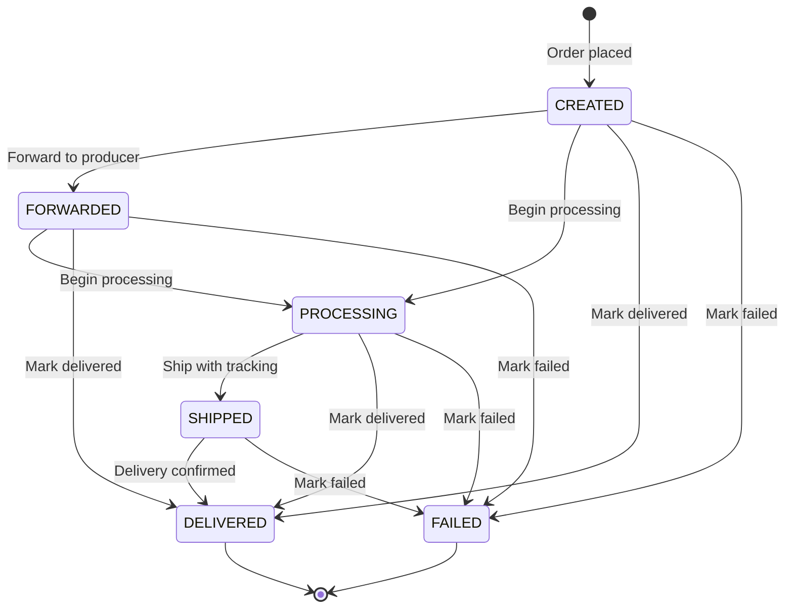

When a customer buys one of your products, LikeTik creates fulfillment items. You are responsible for processing and delivering them. Right now, you discover new items by **polling** the fulfillment endpoint. Webhook-based notifications are planned for a future release (see [Webhooks](/docs/webhooks)).

### 6.1 Overview

Here is how the fulfillment flow works:

1. A customer places an order on TikTok that includes your product(s)
2. LikeTik creates fulfillment items with status `CREATED`
3. You poll `GET /api/v1/supplier/fulfillment` to pick up new items
4. You update each item's status as you process, ship, and deliver it

### 6.2 Retrieve Fulfillment Items

Poll for fulfillment items assigned to you.

```bash
curl -X GET "https://backend-test.liketik.com/api/v1/supplier/fulfillment?page=1&size=20" \
  -H "Authorization: Bearer ${ACCESS_TOKEN}"
```

**Response** `200 OK`:

```http
HTTP/1.1 200 OK
Content-Type: application/json
X-Rate-Limit-Remaining: 18
X-Rate-Limit-Plan: light

{
  "pagination": {
    "page": 1,
    "total_pages": 3,
    "total_items": 42,
    "items_per_page": 20,
    "has_next": true,
    "has_previous": false
  },
  "data": [
    {
      "fulfillment_id": "F_a2b29477-1a2b-5c3d-9e4f-5a6b7c8d9e0f",
      "items": [
        {
          "item_id": "FI_019477f8-1a2b-7c3d-9e4f-5a6b7c8d9e0f",
          "product_id": "P_8f14e45f-ceea-5367-b3c5-1a8e3c7f0c42",
          "variant_id": "PV_3c9a7e6b-d4f2-5a1e-8b7c-9d0e1f2a3b4c",
          "quantity": 1,
          "status": "CREATED"
        }
      ]
    }
  ]
}
```

**Query parameters:**

| Parameter | Required | Default | Constraint | Description |
|-----------|----------|---------|------------|-------------|
| `page` | No | `1` | Minimum `1` | Page number (1-based) |
| `size` | No | `20` | Minimum `1`, maximum `100` | Items per page |
| `status` | No | Non-terminal | -- | Filter by fulfillment item status |

> **Note:** Without a `status` filter, the endpoint returns items in non-terminal states: `CREATED`, `FORWARDED`, `PROCESSING`, `SHIPPED`, and `FAILED`. Terminal items (`DELIVERED`) are excluded unless you filter for them explicitly.

### 6.3 Fulfillment Item Status Transitions

Fulfillment items move through a series of statuses. The system enforces **forward-only progression** for non-terminal states. You cannot move an item backward (e.g., from `PROCESSING` back to `CREATED`).



**Status summary:**

| Status | Level | Terminal | Description |
|--------|-------|----------|-------------|
| `CREATED` | 0 | No | Item created, awaiting supplier action |
| `FORWARDED` | 1 | No | Forwarded to a third-party producer (optional step) |
| `PROCESSING` | 2 | No | Supplier is actively working on the item |
| `SHIPPED` | 3 | No | Item dispatched with tracking information |
| `DELIVERED` | 100 | Yes | Item delivered to customer |
| `FAILED` | 100 | Yes | Fulfillment failed (e.g., out of stock or cancelled) |

**Transition rules:**
- Non-terminal states move forward only, based on level (e.g., `PROCESSING` at level 2 cannot go back to `FORWARDED` at level 1)
- `FORWARDED` is optional. You can go from `CREATED` to `PROCESSING` if you do not use a third-party producer
- Any non-terminal state can transition to a terminal state (`DELIVERED`, `FAILED`)
- Terminal states are final. No further transitions allowed

### 6.4 Mark Items Processing

Tell the API you started working on these items.

```bash
curl -X POST https://backend-test.liketik.com/api/v1/supplier/fulfillment/F_a2b29477-1a2b-5c3d-9e4f-5a6b7c8d9e0f/process \
  -H "Authorization: Bearer ${ACCESS_TOKEN}" \
  -H "Content-Type: application/json" \
  -d '{
    "item_ids": ["FI_019477f8-1a2b-7c3d-9e4f-5a6b7c8d9e0f"]
  }'
```

**Response:** `204 No Content`

### 6.5 Mark Items Forwarded

Mark items as forwarded to a third-party producer. This step is optional and only applies if you outsource production.

**Endpoint:** `POST /api/v1/supplier/fulfillment/{fulfillment_id}/forward`

**Request body:**

```json
{
  "item_ids": ["FI_019477f8-1a2b-7c3d-9e4f-5a6b7c8d9e0f"],
  "external_order_id": "EXT-ORD-20250115-001"
}
```

`external_order_id` is required. It is the order identifier in your third-party producer's system.

**Response:** `204 No Content`

### 6.6 Mark Items Shipped

Mark items as shipped. You must include tracking information.

```bash
curl -X POST https://backend-test.liketik.com/api/v1/supplier/fulfillment/F_a2b29477-1a2b-5c3d-9e4f-5a6b7c8d9e0f/ship \
  -H "Authorization: Bearer ${ACCESS_TOKEN}" \
  -H "Content-Type: application/json" \
  -d '{
    "item_ids": ["FI_019477f8-1a2b-7c3d-9e4f-5a6b7c8d9e0f"],
    "tracking_info": {
      "carrier": "DHL",
      "tracking_number": "JJD000390012345678",
      "tracking_url": "https://www.dhl.de/en/privatkunden/pakete-empfangen/verfolgen.html?piececode=JJD000390012345678"
    }
  }'
```

**Response:** `204 No Content`

**Tracking info fields:**

| Field | Required | Description |
|-------|----------|-------------|
| `carrier` | Yes | Shipping carrier name (e.g., `DHL`, `UPS`, `FedEx`) |
| `tracking_number` | Yes | Carrier tracking number |
| `tracking_url` | No | URL for the customer to track the shipment |

### 6.7 Mark Items Delivered

Confirm delivery to the customer. This is a terminal state, no further updates allowed.

```bash
curl -X POST https://backend-test.liketik.com/api/v1/supplier/fulfillment/F_a2b29477-1a2b-5c3d-9e4f-5a6b7c8d9e0f/deliver \
  -H "Authorization: Bearer ${ACCESS_TOKEN}" \
  -H "Content-Type: application/json" \
  -d '{
    "item_ids": ["FI_019477f8-1a2b-7c3d-9e4f-5a6b7c8d9e0f"]
  }'
```

**Response:** `204 No Content`

### 6.8 Mark Items Failed

If you cannot fulfill an item (e.g., due to stock issues or cancellation requests), mark it as failed.

**Mark as failed:** `POST /api/v1/supplier/fulfillment/{fulfillment_id}/fail`

```json
{
  "item_ids": ["FI_019477f8-1a2b-7c3d-9e4f-5a6b7c8d9e0f"],
  "reason": "Item out of stock, unable to fulfill"
}
```

The endpoint returns `204 No Content`. The `reason` field is required and cannot be blank.

> **Important:** `DELIVERED` and `FAILED` are terminal. Once an item reaches one of these states, no further status updates are possible.
